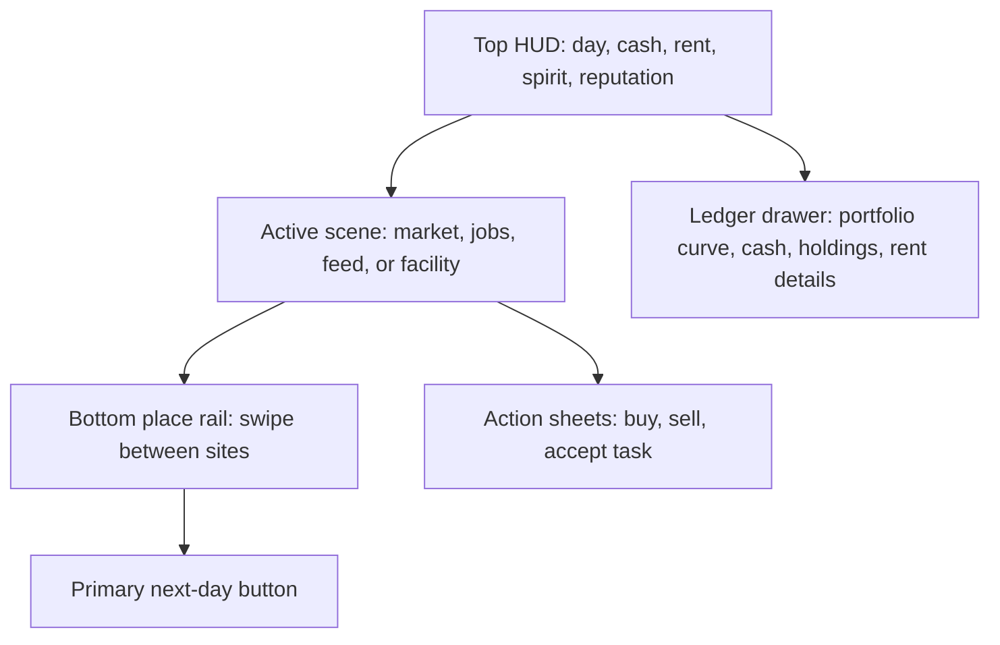

# Mobile Game UI Design

## Goal

Make the game playable on phones without shrinking the desktop three-column layout. Mobile should feel like a compact survival sim: check vital stats, pick a place, take an action, and advance the day.

## Concept

## Player Flow

1. Start from the top HUD to judge survival pressure: cash, rent countdown, spirit, and reputation.
2. Use the bottom rail to switch sites. The main surface only shows the active site.
3. Trade and task screens use stacked cards on mobile instead of dense tables.
4. Open the ledger drawer from the HUD when deeper portfolio, holding, or rent detail is needed.
5. Use the fixed bottom "next day" action to advance the sim without hunting through navigation.

## Interaction Rules

- Desktop keeps the current three-column layout.
- Mobile uses a single-column shell under `md`.
- Persistent mobile chrome stays compact: top HUD plus bottom command dock.
- Detail-heavy surfaces use drawers or scrollable content, not permanent side panels.
- Dialogs become bottom sheets/full-width panels on mobile with large tap targets.

## Implementation Scope

- Add a mobile-only game shell in `GameScreen`.
- Add a mobile top HUD and ledger drawer.
- Add a mobile bottom navigation/action dock.
- Make `TokenMarket` cards replace the table on mobile.
- Make shared modals and key screens fit phone widths and heights.
